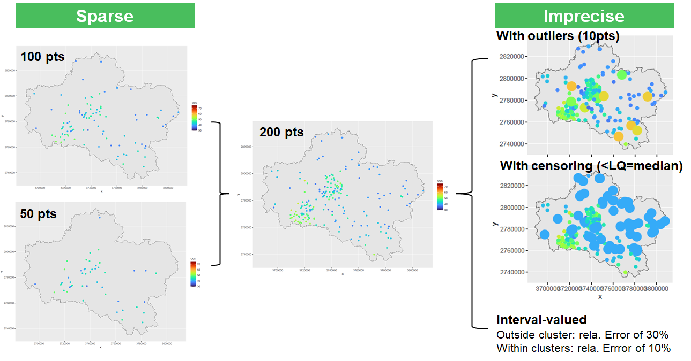
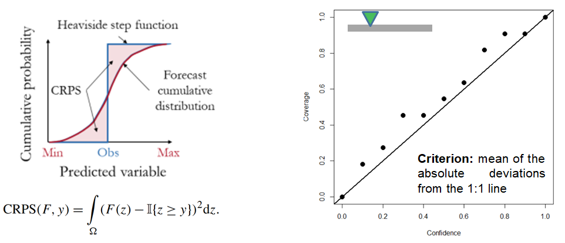

This directory contains the data and R scripts to upload the synthetic cases. A summary is provided in [HOUSES_UncProblem](HOUSES_UncProblem.pdf).

# Data
The synthetic cases focus on the spatial prediction Soil organic carbon stock (OCS, expressed in Mg/ha) in the 0–30 cm layer. The cases are adapted from the procedure described by [de Bruin et al. (2022)](https://doi.org/10.1016/j.ecoinf.2022.101665). The original data (geotiff and shapefiles) can be downloaded [here](https://doi.org/10.5281/zenodo.6513429).

The data are available [here](./data):
| File name     | Description           | Name |
| ------------- |:---------------------:|------|
| OCSdata_full  | reference solution over the whle territory | Full |
| OCSdata_train_clust      | clustered case with 200 pts      | C |
| OCSdata_train_sparse1 | sparse & clustered case with 100 pts     | SC1 |
| OCSdata_train_sparse2 | sparse & clustered case with 50 pts     | SC2 |
| OCSdata_train_outlier | sparse & clustered case with 200 pts and outliers (10)     | SCo |
| OCSdata_train_lq | sparse & clustered case with 200 pts and censoring  | SCc |
| OCSdata_train_imp | sparse & clustered case with 200 pts and imprecise  | SCi |

An overview is given in the figure.

The file for the six experiments *C*, *SC1*, *SC2*, *CIo*, *CIc*, *CIi* contains a data frame with
- the values of the 14 covariates
- the  organic cabron stock *ocs* (variable of interest)
- for *SCi*, the variable *lb* and *up* provide the lower and upper bound of *ocs*

The covariates are described [de Bruin et al. (2022)](https://doi.org/10.1016/j.ecoinf.2022.101665):
| Covariate     | Description           | Name |
| ------------- |:---------------------:|------|
| bio1  | Mean annual air temperature | °C |
| bio5      | Mean daily maximum air temperature of the warmest month | °C |
| bio7 | Annual range of air temperature | °C |
| bio12 | Annual precipitation | kg/m² |
| bio15 | sPrecipitation seasonality | kg/m² |
| ai | Aridity Index | - |
| gdd10 | Growing degree days heat sum above 10 °C | - |
| glc2017 | Landcover 2017 | Categorial |
| dem | Elevation | m |
| slope | Slope | - |
| TPI | Topographic position index | - |
| TRI | Terrain ruggedness index | - |
| TWI | Topographic wetness index | - |
| gedi | Forest height | m |

# Objectives
The objective is to assess different error and uncertainty metrics using the Full dataset (test set).

| Metric     | Description           | Unit |
| ------------- |:---------------------:|------|
| RMSE  | Root Mean Square Error | Mg/ha |
| MAE      | Mean Absolure Error | Mg/ha |
| MaxAE | Maximum Absolute Error | Mg/ha |
| w.PI | width of the prediction interval at 90% (average value over the test set) | Mg/ha |
| cov.PI | coverage of the prediction interval at 90% (average value over the test set) | Mg/ha |
| Mcov.PI | Mean absolute deviation of the accuracy plot | - |
| CRPS | Continuous Ranked Probability Score (average value over the test set) | - |

See [here](https://www.nature.com/articles/s41597-023-02056-8) for *Mcov.PI* and this [here](https://journals.ametsoc.org/view/journals/mwre/133/5/mwr2904.1.xml) for *CRPS*. 
An overview of *Mcov.PI* and *CRPS* is given in the figure.
# Scripts
- The R script [run_qRF](./run_qRF.R) provides an example of the application with the quantile random forest method
- The R script [run_visualisation_data](./run_visualisation_data.R) provides an example for plotting the different cases.
  
